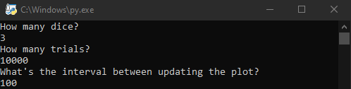
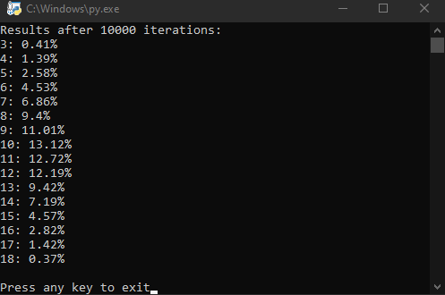
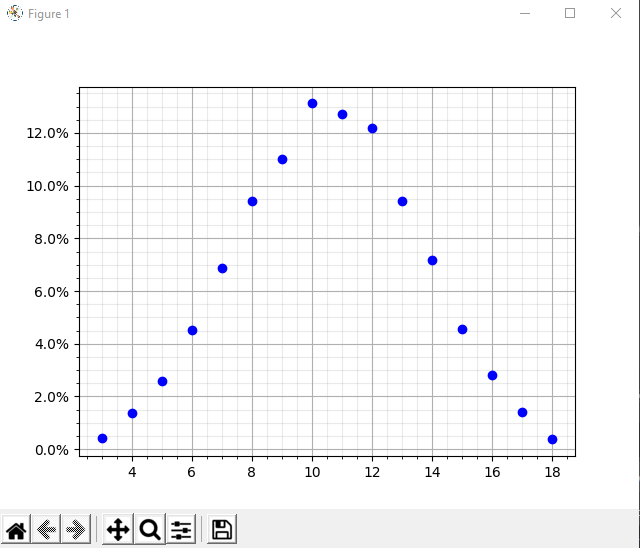
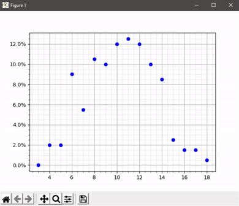

# Dice distribution live histogram
Plots a histogram showing a distribution of sum of chosen number of dice. After inputing number of trials and interval at which the plot will be updating it calculates and shows the % distribution for each of possible values for sum of rolled values. 

# Screenshots

# Skills used
- ploting live results using matplotlib.pyplot module
- calculating results using functions from numpy module

# Possible improvements
- speed up the calculations, using different functions and structures
- find a better way of displaying and overwriting shown results
- prepare a simple GUI
- add ability to automatically save a gif of the plots
